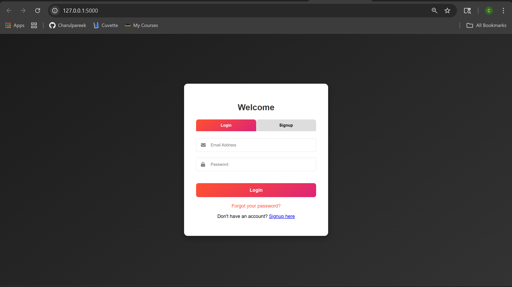
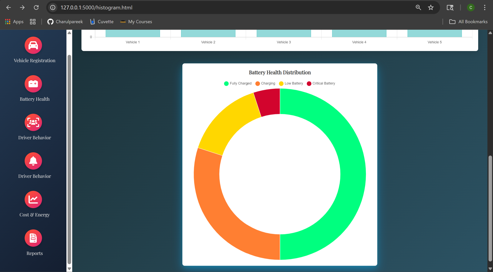
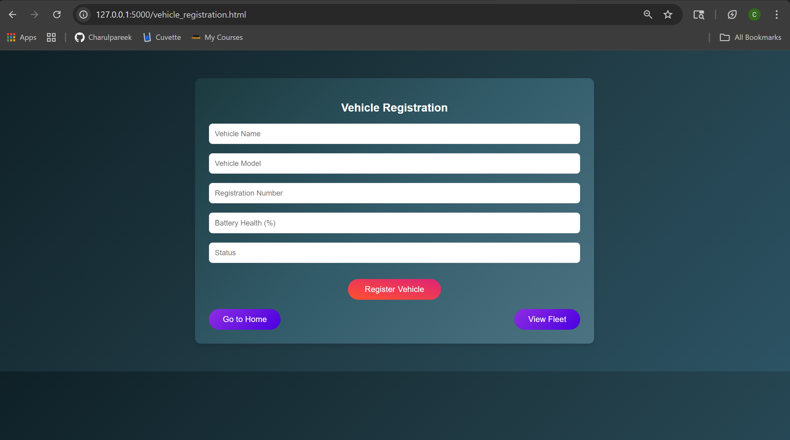
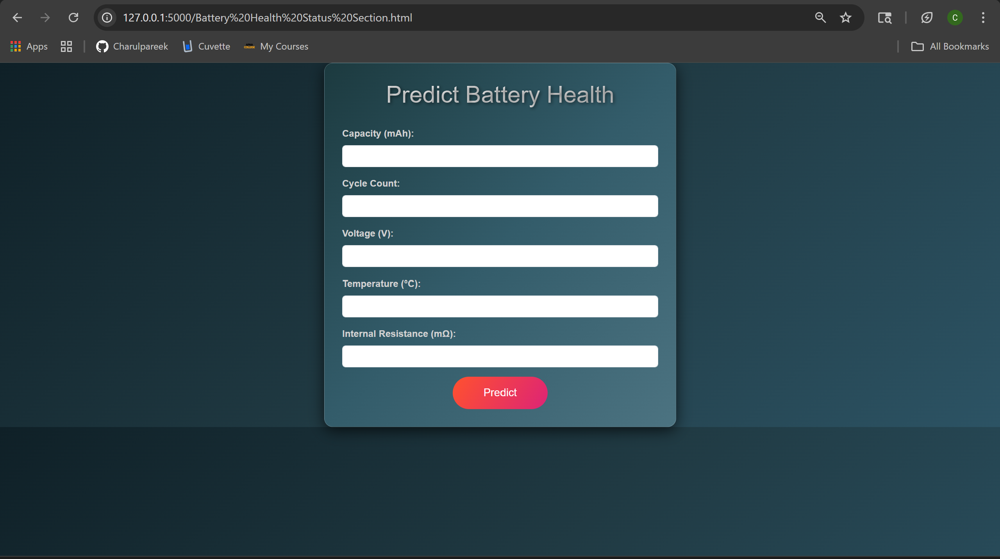
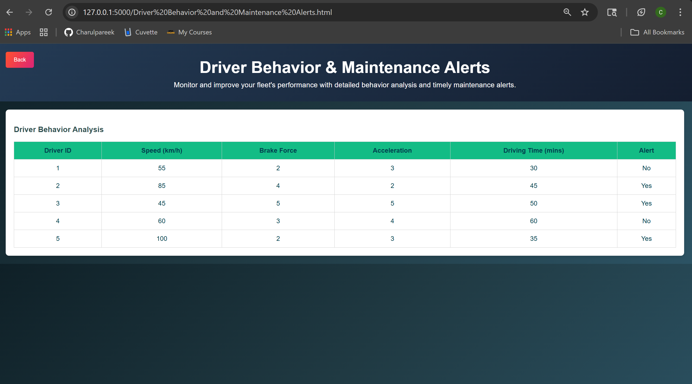
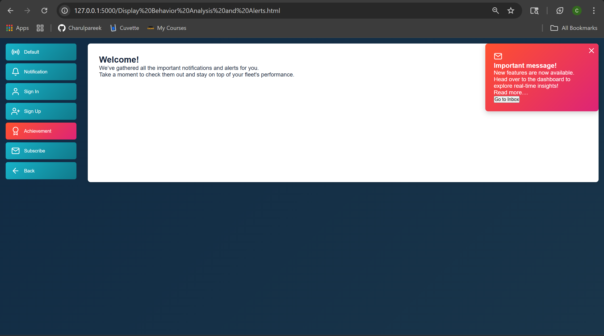
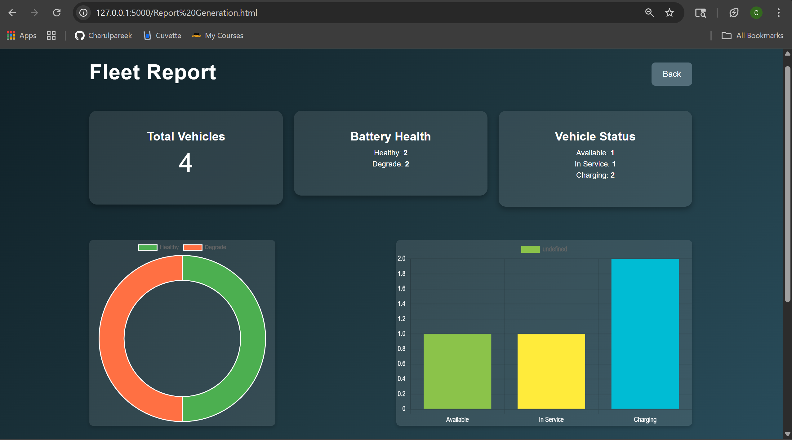
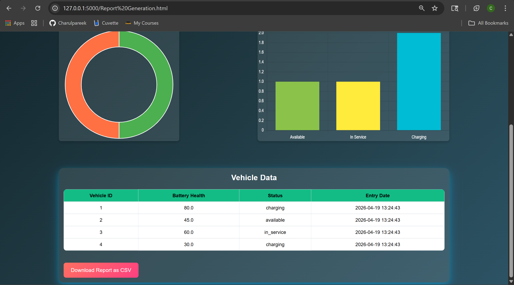

# 🚗 Real-Time EV Fleet Monitoring & Predictive Analytics System ⚡

## 📌 Overview  
A Flask-based web application that enables real-time monitoring and analysis of electric vehicle (EV) fleets. The system tracks vehicle performance, battery health, and operational metrics, helping optimize fleet efficiency and decision-making.

---

## 🚀 Key Features  
- 🔐 User Authentication (Login System)  
- 📊 Interactive Dashboard with Data Visualization  
- 🔋 Battery Health Monitoring  
- 🚘 Vehicle Registration & Tracking  
- ⚠️ Maintenance Alerts System  
- 🔔 Notifications Module  
- 📈 Reports & Analytics  

---

## 🛠️ Tech Stack  
- **Backend:** Python, Flask  
- **Frontend:** HTML, CSS, JavaScript, Chart.js  
- **Database:** SQLite  
- **Libraries:** NumPy, Requests, Geopy, Scikit-learn  

---

## 📸 Screenshots  

### 🔐 Login Page  


---

### 📊 Dashboard  
  


---

### 🚘 Vehicle Registration  


---

### 🔋 Battery Health Monitoring  


---

### ⚠️ Maintenance Alerts  


---

### 🔔 Notifications  


---

### 📑 Reports & Analytics  
  


---

## ⚙️ Installation & Setup  

### 1. Clone the Repository  
```bash
git clone https://github.com/your-username/ev-fleet-monitoring-system.git
cd ev-fleet-monitoring-system
```
### 2. Create Virtual Environment
```bash
python -m venv venv
venv\Scripts\activate
```
### 3. Install Dependencies
```bash
pip install -r requirements.txt
```
### 4. Initialize Databases
```bash
python users_db.py
python create_db.py
```
### Insert Sample Data
```bash
python insert_data.py
```
### 6. Run Application
```bash
python app.py
```
### 7. Open in Browser
```bash
http://127.0.0.1:5000/
```
## 📂 Project Structure
```
ev-fleet-monitoring-system/
│
├── app.py
├── users_db.py
├── create_db.py
├── insert_data.py
│
├── models/
├── static/
├── templates/
├── images/
│
├── README.md
└── requirements.txt
```
## 🔮 Future Enhancements  
- Secure authentication with password hashing  
- Cloud deployment (AWS / Render)  
- Mobile-responsive UI  
- Advanced ML-based predictive analytics  

---

## 📄 License  
This project is licensed under the MIT License.

---

## 🙌 Acknowledgements  
Developed as part of an internship project to demonstrate real-time monitoring, analytics, and web development skills.
